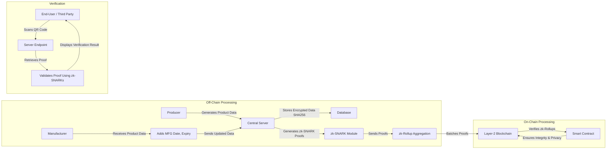
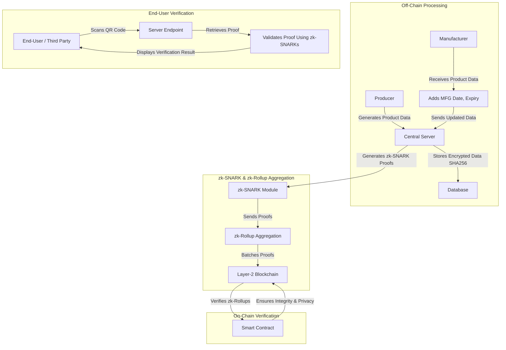

# First, submit farm data

curl -X POST http://localhost:3000/api/submit-farm-data \
-H "Content-Type: application/json" \
-d '{
"farmId": "123456",
"plusCode": "849123",
"batchId": "1001",
"grade": "A"
}'

# Then, using the proofId from the response above

curl -X POST http://localhost:3000/api/add-manufacturing-data/YOUR_PROOF_ID \
-H "Content-Type: application/json" \
-d '{
"batchId": 1001,
"mfgDate": "1767206532",
"expiryDate": "1772304132"
}'

# Verify Link

http://localhost:3000/api/verify/hashed/YOUR_PROOF_HASH

# Get all proofs and their status

http://localhost:3000/api/get-proof-status/

-----------------------------------CHARTS------------------------------

